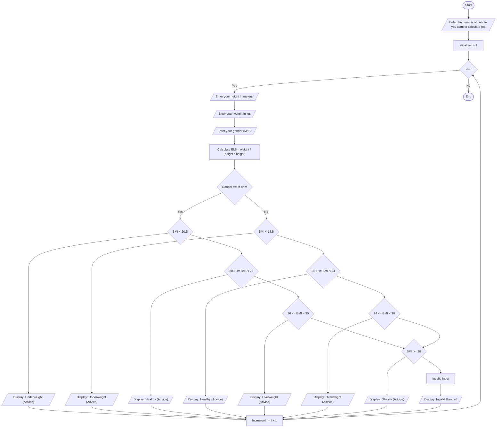

# Problem Analysis:
- This program is made to calculate the bmi of multiple pepole.
## Input:
- number of people to calculate the bmi for.

- for each person it recive height in meter,weight in kg and gender.
## Process:
1,calculate the bmi by using bmi=weight(kg)/(height*height).

2,catgorize their bmi for male and women 
- Male:
Underweight: BMI < 20.5.
Normal: 20.5 ≤ BMI < 26.
Overweight: 26 ≤ BMI < 30.
Obese: BMI ≥ 30.
- Female:
Underweight: BMI < 18.5.
Normal: 18.5 ≤ BMI < 24.
Overweight: 24 ≤ BMI < 30.
bash Obese: BMI ≥ 30.

3, use 'for loop' for iteration.

## Output:
-print the bmi value and advice them based on their range.
# Pseudocode
### Step 1:
start

### Step 2:
Read number of people

### step 3:
For i=1 to number of people.

### step 4:

Read height, weight, gender  
    - Calculate BMI as weight / (height * height)  
    - If gender is male  
        - If BMI < 20.5, print "Underweight"  
        - Else if BMI < 26, print "Healthy weight"  
        - Else if BMI < 30, print "Overweight"  
        - Else, print "Obese"  
    - Else if gender is female  
        - If BMI < 18.5, print "Underweight"  
        - Else if BMI < 24, print "Healthy weight"  
        - Else if BMI < 30, print "Overweight"  
        - Else, print "Obese"  
    - Else  
        - Print "Invalid gender" 
        
### step 5: 
- i = i+1
- if i<= number of people goto step 4.
- esle goto step 6.
  
### step 6:
End(Terminate).
# Flow Chart 

        
