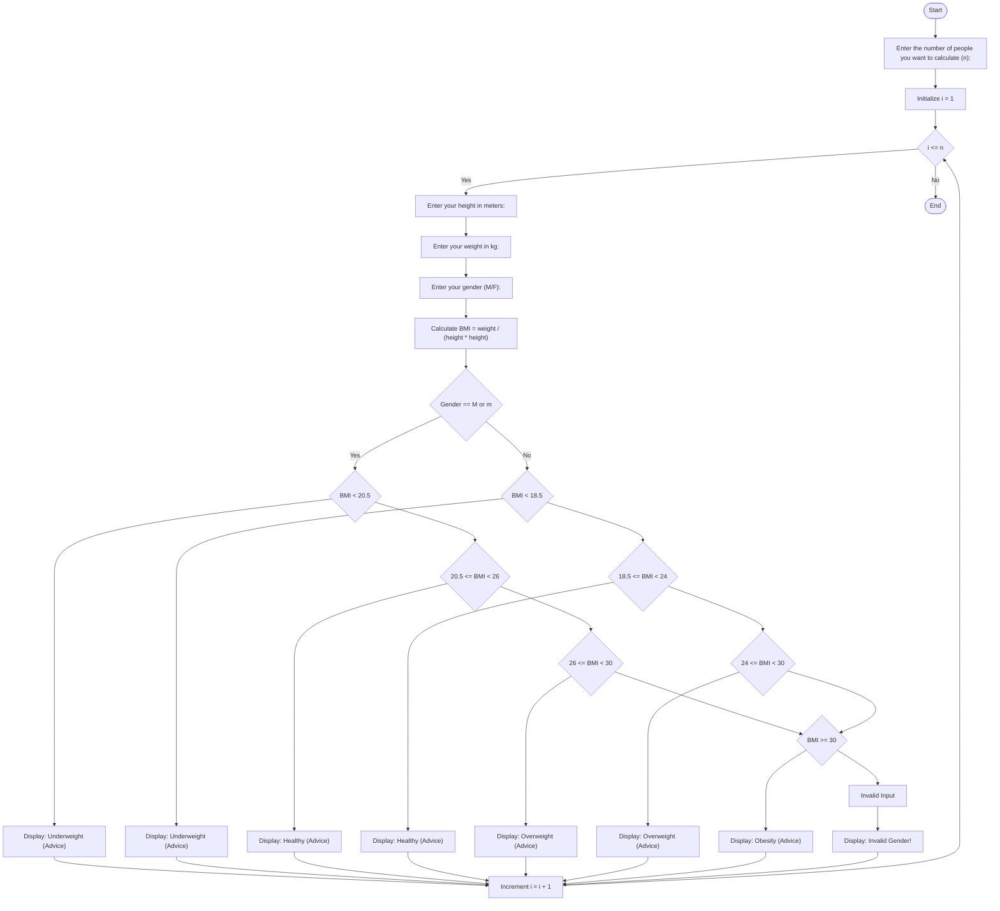

```mermaid
flowchart TD
    Start([Start]) --> InputNumber["Enter the number of people you want to calculate (n):"]
    InputNumber --> InitLoop["Initialize i = 1"]
    InitLoop --> LoopCondition{"i <= n"}
    
    LoopCondition -->|Yes| InputHeight["Enter your height in meters:"]
    InputHeight --> InputWeight["Enter your weight in kg:"]
    InputWeight --> InputGender["Enter your gender (M/F):"]
    InputGender --> CalculateBMI["Calculate BMI = weight / (height * height)"]

    CalculateBMI --> MaleCheck{"Gender == M or m"}
    MaleCheck -->|Yes| MaleUnderweight{"BMI < 20.5"}
    MaleCheck -->|No| FemaleUnderweight{"BMI < 18.5"}
    MaleUnderweight --> DisplayMaleUnderweight["Display: Underweight (Advice)"]
    FemaleUnderweight --> DisplayFemaleUnderweight["Display: Underweight (Advice)"]

    MaleUnderweight --> MaleHealthy{"20.5 <= BMI < 26"}
    FemaleUnderweight --> FemaleHealthy{"18.5 <= BMI < 24"}
    MaleHealthy --> DisplayMaleHealthy["Display: Healthy (Advice)"]
    FemaleHealthy --> DisplayFemaleHealthy["Display: Healthy (Advice)"]

    MaleHealthy --> MaleOverweight{"26 <= BMI < 30"}
    FemaleHealthy --> FemaleOverweight{"24 <= BMI < 30"}
    MaleOverweight --> DisplayMaleOverweight["Display: Overweight (Advice)"]
    FemaleOverweight --> DisplayFemaleOverweight["Display: Overweight (Advice)"]

    MaleOverweight --> ObesityCheck{"BMI >= 30"}
    FemaleOverweight --> ObesityCheck
    ObesityCheck --> DisplayObesity["Display: Obesity (Advice)"]

    ObesityCheck --> InvalidGender["Invalid Input"]
    InvalidGender --> DisplayInvalid["Display: Invalid Gender!"]

    DisplayMaleUnderweight --> Increment["Increment i = i + 1"]
    DisplayFemaleUnderweight --> Increment
    DisplayMaleHealthy --> Increment
    DisplayFemaleHealthy --> Increment
    DisplayMaleOverweight --> Increment
    DisplayFemaleOverweight --> Increment
    DisplayObesity --> Increment
    DisplayInvalid --> Increment

    Increment --> LoopCondition
    LoopCondition -->|No| End([End])
```